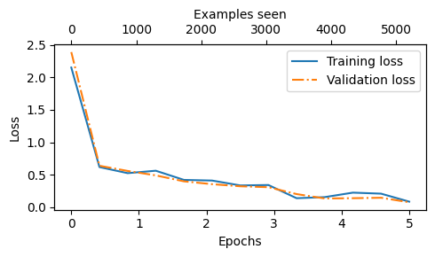
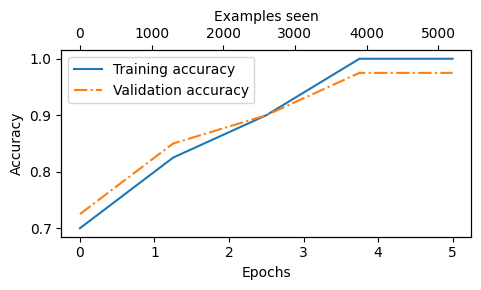
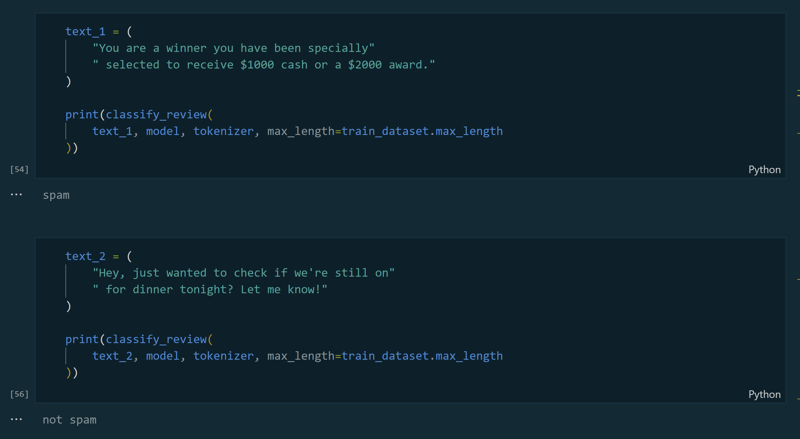

# GPT2-Finetuning-for-Spam-Detection

This project demonstrates how to fine-tune a pre-trained GPT-2 model for binary classification of SMS messages as spam or non-spam (ham).

## Overview

The project uses the GPT-2 pre-trained model and fine-tunes it on an SMS spam detection dataset. Only the final transformer block and the classification head are trained, which allows for efficient transfer learning using the powerful language understanding capabilities of GPT-2.

This implementation is based on concepts and techniques from the book "Build a Large Language Model From Scratch" by Sebastian Raschka. The code has been adapted from the book's tutorials.

## Dataset

The project uses the [SMS Spam Collection Dataset](https://archive.ics.uci.edu/ml/datasets/SMS+Spam+Collection) from UCI Machine Learning Repository. This dataset contains 5,574 English SMS messages, labeled as either "ham" (legitimate) or "spam".

For training, a balanced dataset is created by sampling an equal number of ham messages to match the number of spam messages.

## Requirements

To install the required packages, run:

```
pip install -r requirements.txt
```

## Project Structure

- `Finetuning.ipynb`: Main notebook containing data processing, model training and evaluation
- `Helpers/`: Directory containing utility functions
  - `gpt_download.py`: Functions for downloading and loading GPT-2 model weights
  - `Utils.py`: Implementation of the GPT-2 model architecture and utility functions

## Model Architecture

The project uses a GPT-2 model with:
- Pre-trained weights for token and position embeddings
- Multiple transformer blocks with multi-head attention
- A customized classification head for binary classification

### Training Configuration

The model was trained with the following configuration:
- **Epochs**: 5
- **Loss function**: Cross Entropy Loss
- **Optimizer**: AdamW
- **Learning rate**: 5e-5
- **Weight decay**: 0.1
- **Batch size**: 8
- **Training time**: Approximately 3 minutes

The training was performed on an Azure compute instance with the following specifications:
- **VM Size**: Standard_E20d_v5
- **CPU**: 20 cores
- **RAM**: 160 GB
- **Storage**: 750 GB disk

## Training Process

The model is trained by:
1. Loading pre-trained GPT-2 weights
2. Freezing most layers except the final transformer block
3. Adding a classification head on top
4. Fine-tuning on balanced SMS data

## Model Performance

After fine-tuning for 5 epochs, the model achieved the following accuracy:

- **Training accuracy**: 98.31%
- **Validation accuracy**: 98.75%
- **Test accuracy**: 98.75%

Loss vs Epochs



Accuracy vs Epochs



## Example Usage
